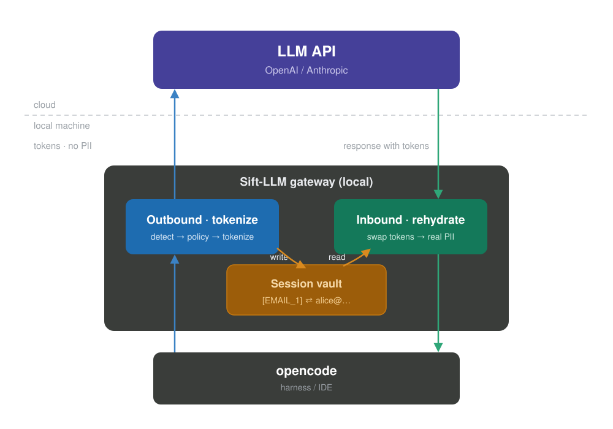

# Sift-LLM: usar los mejores modelos de la nube sin regalarles tus datos

> Cómo un pequeño proxy local te deja tener a la vez la calidad de un modelo grande
> y la privacidad de uno que corre en tu máquina.

## El dilema que aparece en cuanto enchufas un agente de IA a tu código

Los agentes de programación (opencode, y en general cualquier herramienta que hable
con OpenAI o Anthropic) son enormemente útiles. Pero tienen un efecto secundario del
que casi nadie habla: para ayudarte, leen tu código, tus logs y tu configuración, y
todo eso viaja a un servidor de un tercero.

Y ahí no va solo "código". Van claves de API, cadenas de conexión a bases de datos,
correos de clientes, nombres reales, tokens. No salta ninguna alerta de transferencia
de ficheros. Ninguna regla de DLP se dispara. Simplemente lo pegas en el prompt, o el
agente abre un fichero, y esos datos ya están fuera de tu máquina.

## Nube contra local: un falso dilema

La respuesta habitual a este problema se plantea como una elección entre dos males:

- **Modelo en la nube.** Calidad y velocidad de primera. A cambio, mandas datos
  sensibles a una empresa externa y confías en su política de retención.
- **Modelo local.** Tus datos no salen de casa. A cambio, calidad y velocidad
  peores, y hardware caro para acercarte siquiera a un modelo grande.

Se presenta como si tuvieras que sacrificar una cosa para tener la otra: o buen
modelo o privacidad. Sift-LLM parte de la idea de que ese dilema es falso. **Lo que
sale de tu máquina no tiene por qué ser lo mismo que procesa el modelo.**

Si antes de que la petición salga sustituyes los datos sensibles por marcadores, y
al volver la respuesta deshaces esa sustitución, consigues las dos cosas a la vez: el
modelo grande de la nube trabaja con la estructura de tu problema, pero nunca ve el
dato real. La calidad es la del modelo de la nube. La privacidad es la de uno local.

## La idea: un proxy local que anonimiza y rehidrata

Sift es un proxy inverso que corre en tu propia máquina. El agente cree que habla
directamente con la API del modelo, pero en medio hay dos pasos:

- **Salida (outbound).** Detecta los datos sensibles, aplica tu política y sustituye
  cada valor por un token estable antes de que la petición cruce a la nube. Lo que
  viaja son tokens, sin PII.
- **Entrada (inbound).** Cuando la respuesta vuelve con esos tokens dentro, los
  cambia de nuevo por los valores reales antes de entregársela al agente.
- **Vault de sesión.** Una pequeña bóveda en memoria guarda la correspondencia
  `token ⇄ valor` para que la vuelta sea posible. Cifrada, viva solo durante la
  sesión, nunca escrita a disco.

El agente ve datos reales y útiles. El proveedor del modelo solo ve tokens. Ni el
agente ni el proveedor se enteran de que hay algo en medio.

## Paso 1: detectar lo sensible

Nada de esto sirve si no se detecta bien qué es sensible. El primer nivel de
detección son expresiones regulares y validadores: patrones para claves de API,
cadenas de conexión, correos, IPs, rutas de fichero, tarjetas. Es rápido,
determinista y cubre la mayoría de secretos que aparecen en un flujo de código.

Un detalle importante: en un agente de programación la PII no entra sobre todo por
lo que tú escribes, sino por lo que **el agente lee**. Cuando abre un `.env`, un
fichero de config o un dump, ahí es donde aparecen los secretos de verdad. Por eso
el detector trata esos contenidos leídos como fuente principal, no como un extra.

## Paso 2: decidir qué hacer con cada dato (políticas)

Detectar no es suficiente: no todo se trata igual. Sift usa un motor de políticas
configurable por categoría, con tres acciones:

- **`pass`.** Se deja pasar. Un dato funcional, como una IP de loopback, que el
  modelo necesita para ayudarte de verdad.
- **`pseudonymize`.** Se sustituye por un token reversible. Correos, nombres:
  cosas que quieres recuperar en la respuesta.
- **`block`.** Se corta de forma irreversible. Secretos puros como claves de API o
  contraseñas: eso nunca debería volver, así que ni se guarda para rehidratar.

La regla de oro es sencilla: **secreto que no necesitas de vuelta, block; dato
personal que sí necesitas de vuelta, pseudonymize; dato funcional, pass.** Y hay un
modo `shadow` que solo audita sin tocar nada, para calibrar las reglas antes de
dejar que actúen y romper algo.

## El modelo pequeño que viene: detección semántica (NER)

Las expresiones regulares tienen un techo. Ven un correo porque tiene una `@`, pero
no ven que "escríbele a María González, la responsable de soporte" contiene el nombre
de una persona. Para eso hace falta entender el lenguaje, no solo emparejar patrones.

La siguiente pieza (**todavía no programada**, está en el roadmap) es un modelo de
NER pequeño que corre **dentro del propio proxy**, en tu máquina, sin conexión a
ningún servicio externo. Un modelo compacto de reconocimiento de entidades,
ejecutado en proceso, que detecta nombres, direcciones y otras entidades que el regex
no puede pillar.

Lo interesante del enfoque es la división de trabajo: el modelo pequeño y local hace
la parte delicada (encontrar y ocultar lo sensible) y el modelo grande de la nube
hace la parte pesada (razonar sobre tu problema). El modelo grande nunca ve el dato;
el modelo pequeño nunca sale de tu máquina.

## El vault y la coherencia de los tokens

Para que la rehidratación funcione, los tokens tienen que ser **coherentes**. Si
`alice@empresa.com` se convierte en `[EMAIL_1]`, tiene que ser `[EMAIL_1]` durante
toda la sesión, no `[EMAIL_1]` una vez y `[EMAIL_3]` a la siguiente. Si no, el modelo
pierde el hilo de a quién te refieres y la conversación multi-turno se rompe.

El vault es un mapa bidireccional en memoria que garantiza esa coherencia: antes de
crear un token nuevo comprueba si el valor ya tiene uno y lo reutiliza. El formato
`[TIPO_N]` con corchetes está elegido a propósito para que el modelo lo trate como
un marcador y lo copie tal cual en vez de reescribirlo. Y como contiene PII real,
vive cifrado, muere con la sesión, se borra de memoria de forma determinista y nunca
aparece en los logs.

## Rehidratación: la parte que hace que se sienta natural

Aquí está la diferencia entre "redacción" (tachar y ya) y "anonimización reversible".
Un proxy que solo tacha te devuelve una respuesta llena de `[EMAIL_REDACTED]`: segura,
pero incómoda de leer y de usar. Sift da un paso más y **deshace** la sustitución en
la respuesta, para que la experiencia sea como si nunca hubiera habido un intermediario.

Esto tiene su miga técnica, porque la respuesta llega en streaming, trozo a trozo. El
rehidratador usa un buffer con ventana deslizante: acumula fragmentos, sustituye los
tokens completos y retiene la cola que podría ser el principio de un token a medias
(por ejemplo `[EMA`) hasta que llegue el siguiente trozo. También entra en los
argumentos de las llamadas a herramientas: si el modelo responde
`send_email(to="[EMAIL_1]")`, hay que devolver el correo real antes de que el agente
ejecute esa acción, o mandaría el mail a un token literal.

El resultado, de cara al usuario, es que todo fluye. Ves nombres reales, correos
reales, respuestas útiles. Lo único que cambió es que el modelo de la nube, por el
camino, nunca llegó a verlos.

## Dónde está hoy y hacia dónde va

Sift se está construyendo por fases, y conviene ser honesto sobre qué funciona ya y
qué no:

1. **Redacción regex de una dirección (hecho).** Proxy funcionando, detección por
   patrones, redacción irreversible. Ya es útil por sí solo.
2. **Motor de políticas (hecho).** `pass` / `redact` / `block` por categoría,
   allowlist y modos shadow/enforce.
3. **Vault reversible y rehidratación (siguiente).** El salto de "tachar" a
   "anonimizar y devolver". Aquí entra el buffer de streaming.
4. **Herramientas.** Rehidratar argumentos de tool_calls y escanear lo que el agente
   lee.
5. **NER local.** El modelo pequeño para la PII semántica.
6. **Multiproveedor.** Adaptador para Anthropic además de OpenAI.

El diagrama de arriba muestra el flujo completo, que es el objetivo. Hoy Sift hace la
parte de detección y redacción; la tokenización reversible y la rehidratación son el
siguiente hito.

## Cierre

La premisa de Sift-LLM es que no deberías tener que elegir entre un buen modelo y tu
privacidad. Con un proxy local que anonimiza a la salida y rehidrata a la entrada, el
dato sensible se queda en tu máquina y el modelo grande sigue haciendo su trabajo con
la estructura del problema. Buena calidad y datos en casa, a la vez.

El proyecto es open source y está en desarrollo activo:
[github.com/arturoaguileraa/sift-llm](https://github.com/arturoaguileraa/sift-llm).
